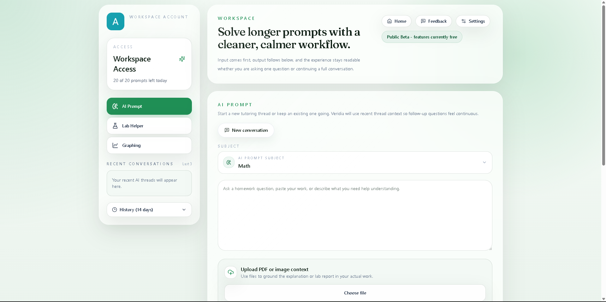

# Veridia

Structuring AI to help you learn.

## Overview

Veridia is an AI-powered STEM learning workspace designed to support real academic workflows, not just generate answers. It helps users ask better questions, receive structured explanations, draft lab reports, and create clean graphs inside a focused interface built around clarity and usability.

## Screenshots

**Home Page**

**Application Interface**

## Features

- AI-powered STEM problem solving across subjects such as math, physics, chemistry, statistics, and related technical topics
- Structured, readable explanations designed to feel guided rather than generic
- Dedicated graphing workflow with downloadable outputs
- File uploads for prompt and lab workflows, including PDF, image, and text-based context
- Threaded AI conversations with recent and history views for continuity
- Lab Helper workflow for turning rough notes into stronger report drafts
- Feedback submission flow for product iteration
- Admin controls for user and feedback review
- Clean responsive interface with light and dark mode support

## Tech Stack

- Frontend: Next.js 15, React 19, TypeScript, Tailwind CSS, Framer Motion
- Backend: FastAPI, SQLAlchemy, PostgreSQL, Python
- AI: OpenAI API
- Analytics: PostHog
- Graphing and parsing: matplotlib, NumPy, PyPDF, Pillow
- Billing and auth: Stripe, Google Identity / Google Auth

## How It Works

1. A user submits a prompt, lab draft, or graphing request from the Veridia workspace.
2. The backend processes the request, attaches any uploaded context, and routes the task through the appropriate service.
3. OpenAI-generated output is structured and returned to the frontend for readable presentation.
4. For graphing and file-based workflows, Veridia can generate downloadable visual outputs or use uploaded materials to ground the response.

## Current Status

### Public Beta

Veridia is currently in a public beta phase. The product is actively being refined through testing, iteration, and user feedback, and features may continue to evolve as the platform matures.
